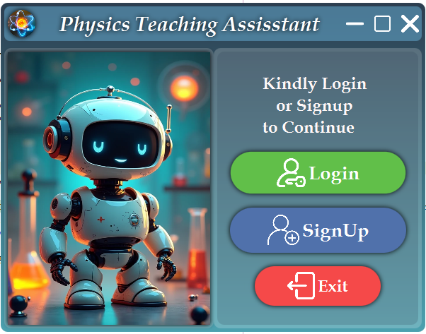
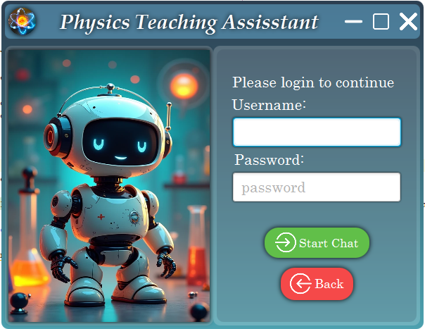
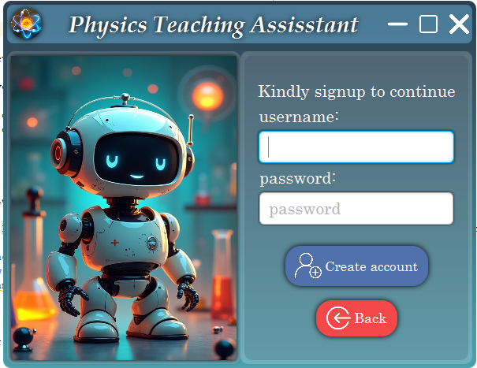
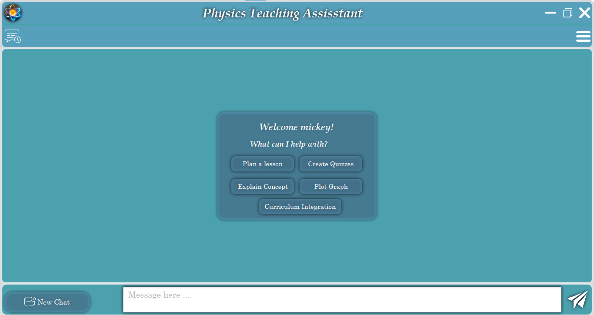
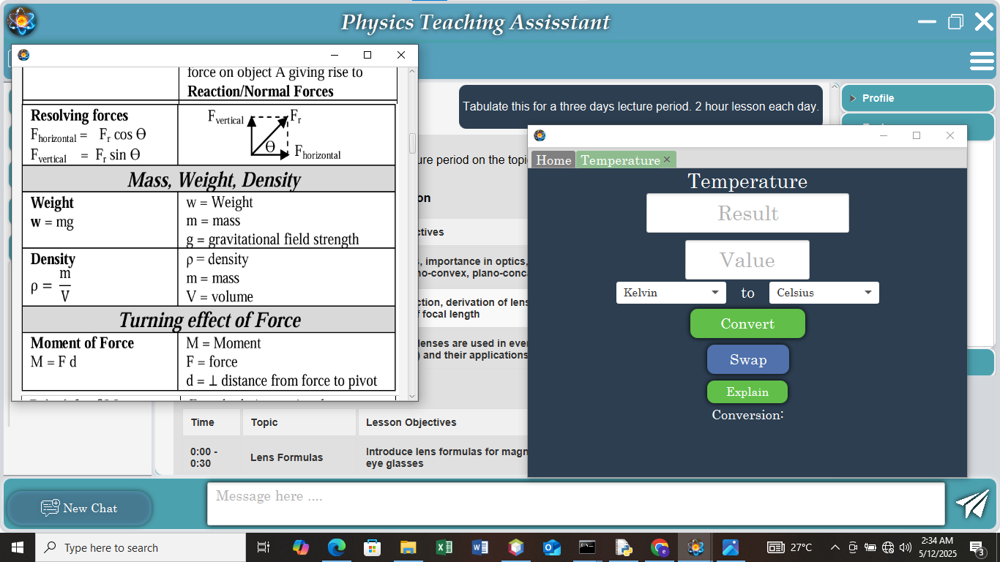
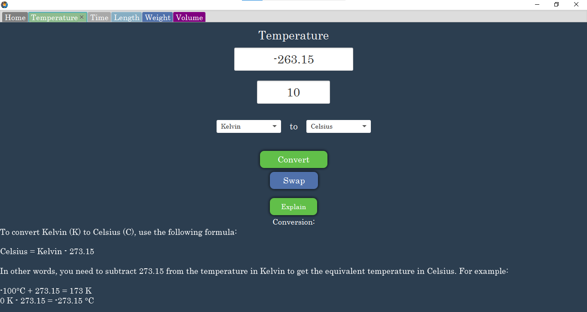
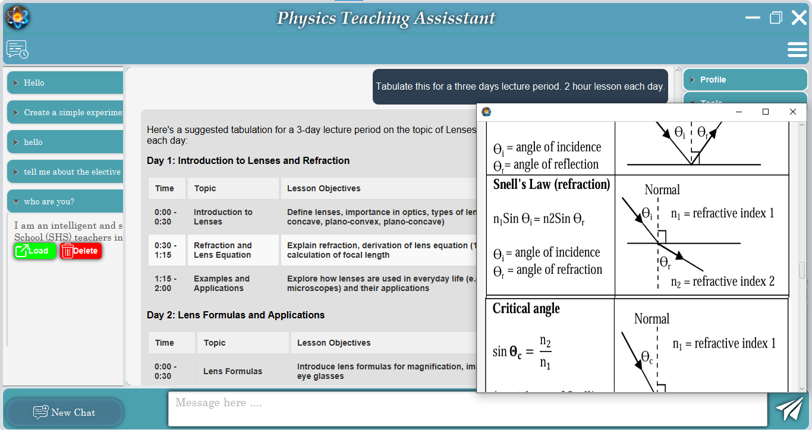
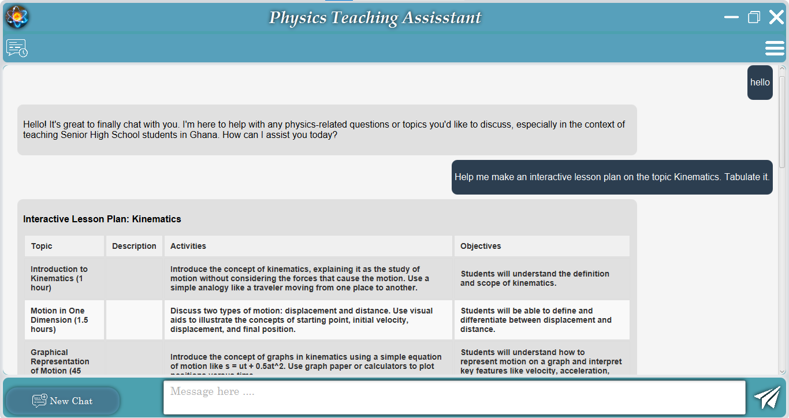
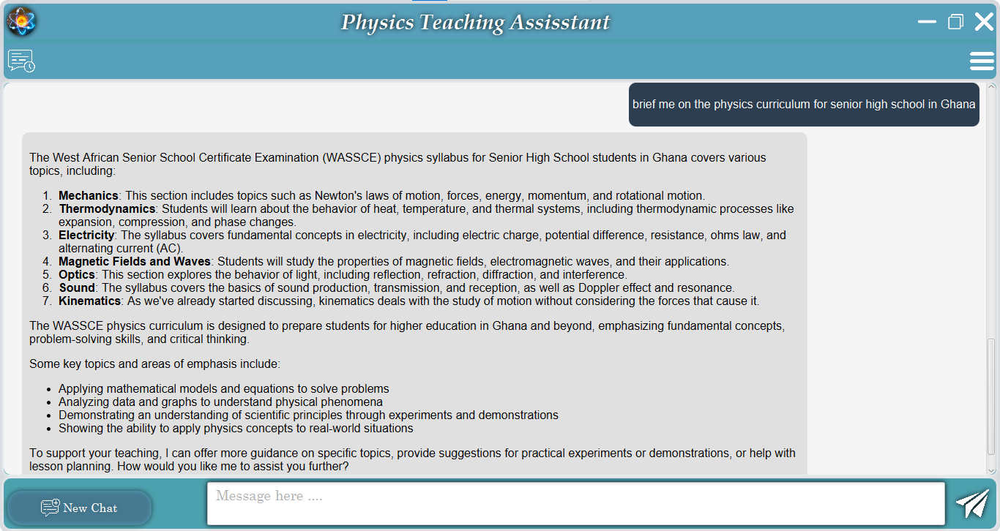

# Physics Chat Bot App for Senior High School Physics Teachers

---

## Overview

The **Physics Chat Bot App** is a dedicated educational tool designed specifically for Senior High School (SHS) physics teachers. With a suite of powerful features tailored to enhance teaching and planning, this app serves as a comprehensive companion for physics educators to streamline their daily workflows, provide accurate physics explanations, and assist with curriculum integration — all while working smoothly offline.

---

## Features

### Offline Functionality  
No internet? No problem! The app is fully functional offline, allowing teachers to access essential resources and tools anytime, anywhere without connectivity concerns.

### Units Converter and Conversion Explained  
Quickly convert between different physical units and gain detailed, easy-to-understand explanations about the conversion process to support deeper comprehension and accurate usage.

### Formula Sheet  
Access a robust formula sheet packed with essential physics equations and formulas, providing handy reference material for teaching and problem-solving.

### Lesson Planner  
Plan your lessons efficiently using the integrated lesson planner. Organize topics, set objectives, and schedule activities to keep your teaching on track.

### Integrated Curriculum  
The app incorporates the SHS physics curriculum standards, ensuring all lesson plans, formulas, and resources align closely with your teaching requirements.

---

## Screenshots

*Login or Signup for users.*

*Login Page.*

*Signup Page.*

*Chat Interface.*

  
*Using the app easily without internet connection.*

  
*Convert and understand unit conversions with clarity.*

  
*Quick access to essential formulas.*

  
*Organize and schedule your lessons.*

  
* Align lessons with educational standards.*

---

## Getting Started

1. **Download the app** to your desktop using the link below.
2. 
3. **Download the MiddleWare** to your desktop using the link below.
4. 
5. **Download ollama and pull llama3.2:** the current Implementation of this app requires ollama.
6. 
7. **Future Implementations will be a standalone application with llm model embedded** __Stay Tuned for that !__ 
8. **No internet is needed** after initial download.
9. **Explore the features** like units conversion, formula reference, and lesson planning.
10. Use the integrated curriculum to **align lessons with educational standards**.

---

## Intended Audience

- Senior High School Physics Teachers  
- SHS Curriculum Coordinators  
- Physics Educators looking for teaching support tools

---

## Technologies

- Developed with Java with JavaFX ensuring cross-platform compatibility
- SQLITE for local data storage.
- LLM (llama3.2), NLTK, FAISS, FASTAPI for MiddleWare implementations.
- Offline-first approach to provide uninterrupted access  
- Clean, user-friendly UI designed for ease of use  

---

## Contributing

Contributions are welcome! Feel free to open issues or submit pull requests for bug fixes, new features, or improvements.

---

## License

This project is licensed under the MIT License - see the [LICENSE](LICENSE) file for details.

---

## Contact

For more information, feedback, or support, contact:  
Aaron - https://github.com/quami09
Cletus -  https://github.com/Bindiinin
Michael – michael203collins@gmail.com -

---

Thank you for checking out the Physics Chat Bot App!  
Empowering physics teachers, one lesson at a time.

